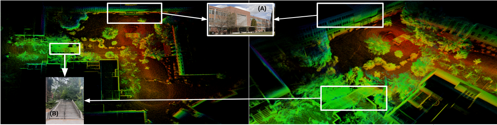

# LIO-IMM: An Effective LiDAR-Inertial Odometry Using Interacting Multiple Models for Localization and Mapping
LIO-IMM is a high-level fusion framework for multiple motion models, capable of flexibly estimating both linear and non-linear trajectories resulting from aggressive movements, using point-to-point GICP for registration. 
The paper has been submitted to ICRA 2025 and is currently under review.

<p align='center'>
    
</p>

# Dependencies
The framework has been tested with ROS Noetic and Ubuntu 20.04. The following configuration, along with the required dependencies, has been verified for compatibility:

- [Ubuntu 20.04](https://releases.ubuntu.com/focal/)
- [ROS Noetic](http://wiki.ros.org/noetic/Installation/Ubuntu) (```roscpp```, ```std_msgs```, ```sensor_msgs```, ```geometry_msgs```)
- C++ 14
- [CMake >= 3.16.3](https://cmake.org/download/)
- [PCL >= 1.8](https://pointclouds.org/downloads/)
- [Eigen >= 3.3.4](http://eigen.tuxfamily.org/index.php?title=Main_Page)
- [ZED SDK >= 3.5](https://www.stereolabs.com/developers)
- [CUDA](https://developer.nvidia.com/cuda-downloads) (Recommend to use CUDA toolkit >= 11 for Ubuntu 20.04)

```
    sudo apt install libomp-dev libpcl-dev libeigen3-dev
```

The LIO-IMM has been tested with various LiDAR configurations, including Velodyne, Ouster, and Hesai, requiring the point cloud in the format of ```sensor_msgs::PointCloud2``` and the IMU in the format of ```sensor_msgs::IMU```. To ensure optimal performance, the LiDAR-IMU system should be well-calibrated and time-synchronized.

# Install
Clone the ``` LIO-IMM ``` repository into the catkin workspace ``` ~/catkin_ws/src/ ``` folder, and compile package (LIO-IMM supports implementation in ROS1 as default)

```
    mkdir catkin_ws && cd catkin_ws && mkdir src && cd src
    git clone https://github.com/aralab-unr/LIO-IMM.git
    cd ..
    source devel/setup.bash
    catkin_make
```
